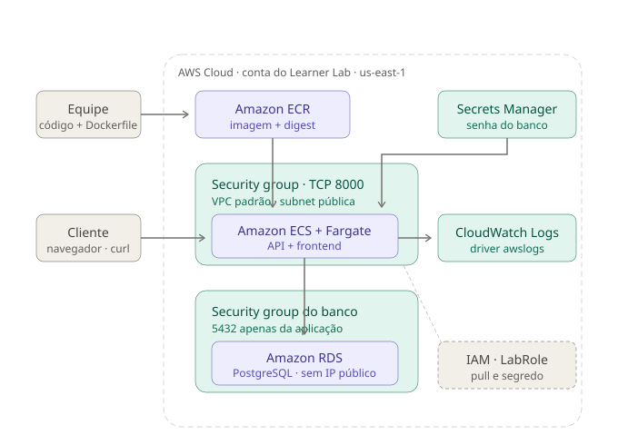

# Arquitetura

Projeto 1 — AWS CloudLab. Versão implantada `v1.1`, com persistência.

## Fluxo

A equipe constrói a imagem a partir do código e do Dockerfile e a publica no
repositório privado do Amazon ECR, identificada por tag e por digest.

A tarefa do Amazon ECS com AWS Fargate executa dentro da VPC padrão, protegida
por um security group que aceita apenas TCP 8000 a partir de endereços
específicos. Ao iniciar, a tarefa obtém a imagem do ECR e recupera a senha do
banco no AWS Secrets Manager — ambas as operações realizadas pela execution
role, antes de o container existir.

O cliente acessa o painel e a API pela porta 8000. Cada evento recebido é
gravado no Amazon RDS e registrado como log estruturado na saída padrão, que o
driver `awslogs` encaminha ao Amazon CloudWatch.

O banco fica em um security group próprio, que autoriza a porta 5432 apenas
para quem pertence ao security group da aplicação. A instância não tem acesso
público e é inalcançável de fora da VPC.

## Distinção de responsabilidades

| Elemento | Papel |
| --- | --- |
| Amazon ECR | Armazena a imagem versionada |
| Amazon ECS com Fargate | Executa o container, sem servidor administrado |
| Amazon RDS | Persiste os eventos |
| Secrets Manager | Guarda a credencial cifrada |
| CloudWatch Logs | Recebe os logs estruturados |
| Security groups | Delimitam quem alcança a aplicação e o banco |
| IAM · LabRole | Autoriza o pull da imagem e a leitura do segredo |

A `LabRole` aparece como anotação tracejada, e não como nó do caminho da
requisição, porque não intermedeia o tráfego HTTP: ela autoriza operações do
ECS antes e durante a execução da tarefa.

## Componentes fornecidos pelo ambiente

A VPC padrão, suas subnets e a role `LabRole` são preexistentes na conta do
Learner Lab. Não são criados nem removidos pelos scripts do projeto.

## Diferença em relação à v1.0-baseline

A versão `v1.0-baseline` não tinha persistência: o evento era validado,
registrado em log e descartado. Não havia banco, security group de banco,
segredo nem frontend. O motivo da mudança está registrado no ADR-002.

## Documentos relacionados

- [Registros de decisão arquitetural](adr/)
- [Matriz de alternativas](matriz-de-alternativas.md)
- [Runbook operacional](RUNBOOK.md)
- [Inventário de recursos](inventario.md)
